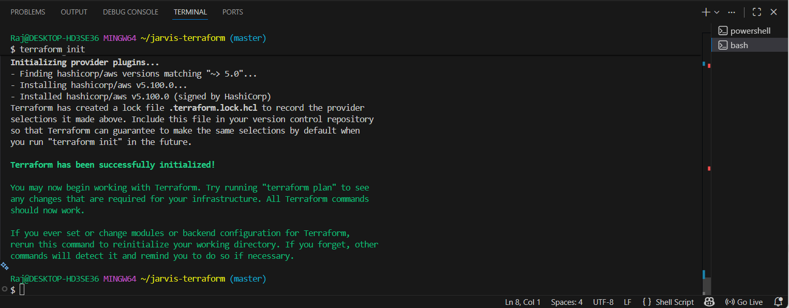

# Deploying the Jarvis Desktop Voice Assistant on AWS EC2 using Terraform and Jenkins

This project demonstrates a complete DevOps workflow for deploying the **Jarvis Desktop Voice Assistant** application on an AWS EC2 instance using **Terraform for Infrastructure as Code (IaC)** and **Jenkins CI/CD** with **GitHub Webhooks** for automated deployments.

It covers:

* Forking and modifying the Jarvis Voice Assistant project
* Provisioning AWS infrastructure using Terraform
* Automating deployments through a Jenkins pipeline
* Triggering deployments on GitHub push events
* Running the application as a systemd-managed service on EC2

---

## 1. Project Architecture

```
GitHub Repository  --->  Jenkins Pipeline  --->  AWS EC2 (Jarvis Application)
         |                      |  
   Webhook Trigger         SSH Deployment  
```

This workflow ensures that every new commit is automatically deployed to the server.

---

## 2. Prerequisites

* AWS Account
* Terraform installed
* Jenkins installed on EC2
* SSH Key Pair
* GitHub account with repository fork
* Basic knowledge of CI/CD and AWS

---

## 3. Step 1: Fork the Repository

Fork the original project:

```
https://github.com/kishanrajput23/Jarvis-Desktop-Voice-Assistant
```

Apply at least one UI or text update and push it to your GitHub repository.

**Screenshot example:**

```

```

---

## 4. Step 2: Provision Infrastructure Using Terraform

Terraform provisions:

* Ubuntu EC2 instance
* Security Group
* SSH Key Pair or imported key
* User Data for application setup
* systemd service for managing the Jarvis application

### Initialize Terraform

```bash
terraform init
```

Screenshot:

```

```

### Generate Execution Plan

```bash
terraform plan
```

Screenshot:

```
images/terraform_plan.png
```

### Apply the Configuration

```bash
terraform apply --auto-approve
```

Screenshot:

```
images/terraform_auto_approve.png
```

### EC2 Dashboard

```
images/servers.png
```

---

## 5. Step 3: Verify Jarvis Service on EC2

Once Terraform completes, SSH into the instance and validate the service:

```bash
sudo systemctl status jarvis
```

Screenshot:

```
images/activate_jarvis.png
```

---

## 6. Step 4: Configure Jenkins

### Add SSH Credentials

Inside Jenkins:

1. Go to **Manage Jenkins → Credentials**
2. Add a new credential:

   * Type: SSH Username with Private Key
   * ID: `devops-key`
   * Username: `ubuntu`
   * Private Key: paste the content of `check.pem`

Screenshot:

```
images/jenkins_credentials.png
```

---

## 7. Step 5: Create a Jenkins Pipeline

Use the following `Jenkinsfile` for automated deployment:

```groovy
pipeline {
    agent any

    environment {
        REMOTE_USER = "ubuntu"
        REMOTE_HOST = "65.2.191.170"
        REMOTE_DIR  = "/home/ubuntu/Jarvis-Desktop-Voice-Assistant"
        SERVICE_NAME = "jarvis"
        CRED_ID = "devops-key"
        SSH_OPTS = "-o StrictHostKeyChecking=no"
    }

    stages {

        stage("Checkout Code") {
            steps {
                git branch: 'main',
                    url: 'https://github.com/<your-username>/Jarvis-Desktop-Voice-Assistant.git'
            }
        }

        stage("Fix Permissions on Server") {
            steps {
                sshagent (credentials: ["${CRED_ID}"]) {
                    sh """
                    ssh ${SSH_OPTS} ${REMOTE_USER}@${REMOTE_HOST} '
                        sudo mkdir -p ${REMOTE_DIR}
                        sudo chown -R ubuntu:ubuntu ${REMOTE_DIR}
                        sudo chmod -R 755 ${REMOTE_DIR}
                    '
                    """
                }
            }
        }

        stage("Deploy Code via rsync") {
            steps {
                sshagent (credentials: ["${CRED_ID}"]) {
                    sh """
                    rsync -avz -e "ssh ${SSH_OPTS}" \
                    --exclude='.git' \
                    --exclude='__pycache__' \
                    ./ ${REMOTE_USER}@${REMOTE_HOST}:${REMOTE_DIR}/
                    """
                }
            }
        }

        stage("Install Dependencies") {
            steps {
                sshagent (credentials: ["${CRED_ID}"]) {
                    sh """
                    ssh ${SSH_OPTS} ${REMOTE_USER}@${REMOTE_HOST} '
                        sudo apt update -y
                        sudo apt install -y python3 python3-pip ffmpeg
                        cd ${REMOTE_DIR}
                        pip3 install -r requirements.txt --break-system-packages || true
                    '
                    """
                }
            }
        }

        stage("Restart Jarvis Service") {
            steps {
                sshagent (credentials: ["${CRED_ID}"]) {
                    sh """
                    ssh ${SSH_OPTS} ${REMOTE_USER}@${REMOTE_HOST} '
                        sudo systemctl daemon-reload
                        sudo systemctl restart ${SERVICE_NAME}
                        sudo systemctl status ${SERVICE_NAME} --no-pager
                    '
                    """
                }
            }
        }
    }
}
```

---

## 8. Step 6: Configure GitHub Webhook

Navigate to:

**GitHub → Repository Settings → Webhooks → Add Webhook**

Use the following settings:

* **Payload URL:**

  ```
  http://<JENKINS_PUBLIC_IP>:8080/github-webhook/
  ```
* **Content type:** `application/json`
* **Event:** Just the push event

---

## 9. Step 7: Automated Deployment Verification

Push any update to GitHub.
Jenkins should automatically run the pipeline and deploy the changes.

Screenshot:

```
images/jenkins_deploy_success.png
```

---

## 10. Conclusion

This project delivers:

* Complete Infrastructure as Code deployment using Terraform
* Automated CI/CD using Jenkins
* Secure, key-based remote deployment
* Continuous deployment through GitHub webhooks
* Systemd-managed long-running Python application

This setup can serve as a scalable template for more complex DevOps architectures.

---

## Future Enhancements

* Integrate CloudWatch logs
* Add reverse proxy with HTTPS
* Introduce Docker and ECS/EKS
* Implement Terraform remote backend (S3 + DynamoDB)
* Add Slack or email notifications

---

## Screenshot Index

| Stage                   | File                              |
| ----------------------- | --------------------------------- |
| Git Clone               | images/git_clone.png              |
| Terraform Init          | images/terraform_init.png         |
| Terraform Plan          | images/terraform_plan.png         |
| Terraform Apply         | images/terraform_auto_approve.png |
| AWS EC2 Dashboard       | images/servers.png                |
| Jenkins Credentials     | images/jenkins_credentials.png    |
| Jenkins Pipeline Output | images/jenkins_deploy_success.png |
| Jarvis Service Status   | images/activate_jarvis.png        |

---

If you want, I can also generate:

* A clean architecture diagram (PNG/SVG)
* A minimal or extended README version
* A version with badges (Terraform, Jenkins, AWS, Build Passing)

Just tell me.
